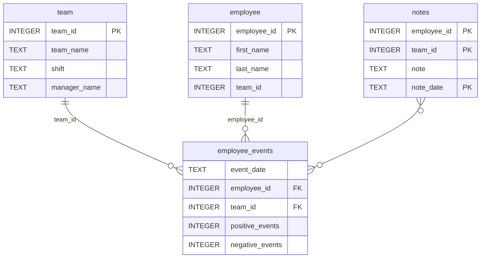

# Software Engineering for Data Scientists

This repository contains the **Employee Performance Dashboard** project for the Software Engineering for Data Scientists final project.

## Overview

This dashboard allows managers to monitor employee performance and predicted risk of recruitment. It queries the `employee_events.db` SQLite database and visualizes employee/team productivity and recruitment likelihood using FastHTML.

## Getting Started

### Prerequisites
- Python 3.10 or higher

### Installation

```bash
# Clone the repository
git clone https://github.com/mauriziopinto/dsnd-dashboard-project.git
cd dsnd-dashboard-project

# Create virtual environment
python -m venv venv
source venv/bin/activate  # On Windows: venv\Scripts\activate

# Install dependencies
pip install -r requirements.txt

# Build and install the Python package
cd python-package
python setup.py sdist
pip install dist/*.tar.gz
cd ..
```

### Running the Application

```bash
python report/dashboard.py
```

Then open http://localhost:8001 in your browser.

### Running Tests

```bash
pytest
```

### Repository Structure
```
├── README.md
├── assets
│   ├── model.pkl
│   └── report.css
├── python-package
│   ├── employee_events
│   │   ├── __init__.py
│   │   ├── employee.py         # Employee query class
│   │   ├── employee_events.db  # SQLite database
│   │   ├── query_base.py       # Base query class
│   │   ├── sql_execution.py    # SQL mixin class
│   │   └── team.py             # Team query class
│   ├── requirements.txt
│   ├── setup.py
├── report
│   ├── base_components
│   │   ├── base_component.py
│   │   ├── data_table.py
│   │   ├── dropdown.py
│   │   ├── matplotlib_viz.py
│   │   └── radio.py
│   ├── combined_components
│   │   ├── combined_component.py
│   │   └── form_group.py
│   ├── dashboard.py            # Main FastHTML dashboard
│   └── utils.py                # Utility functions
├── requirements.txt
├── tests
│   └── test_employee_events.py
└── .github
    └── workflows
        └── test.yml            # GitHub Actions workflow
```

## Database Schema


